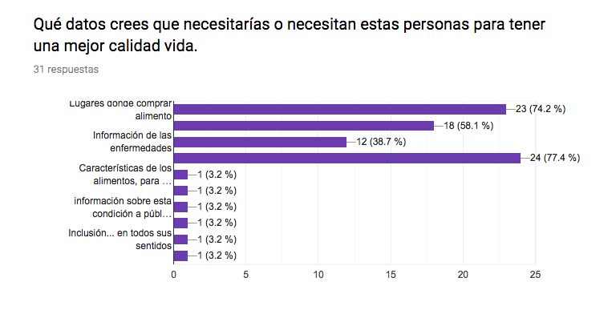
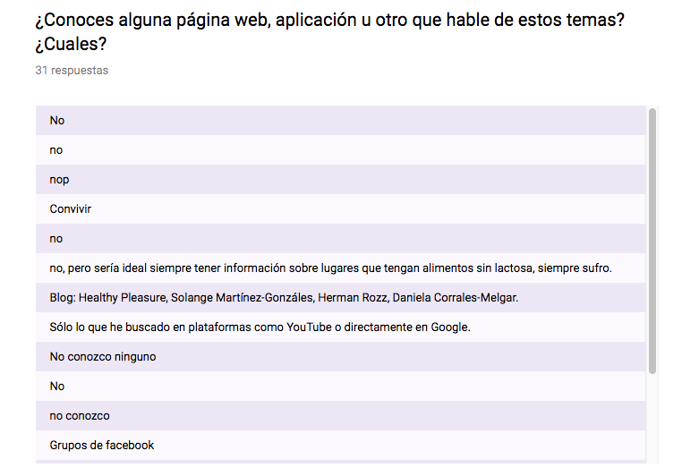
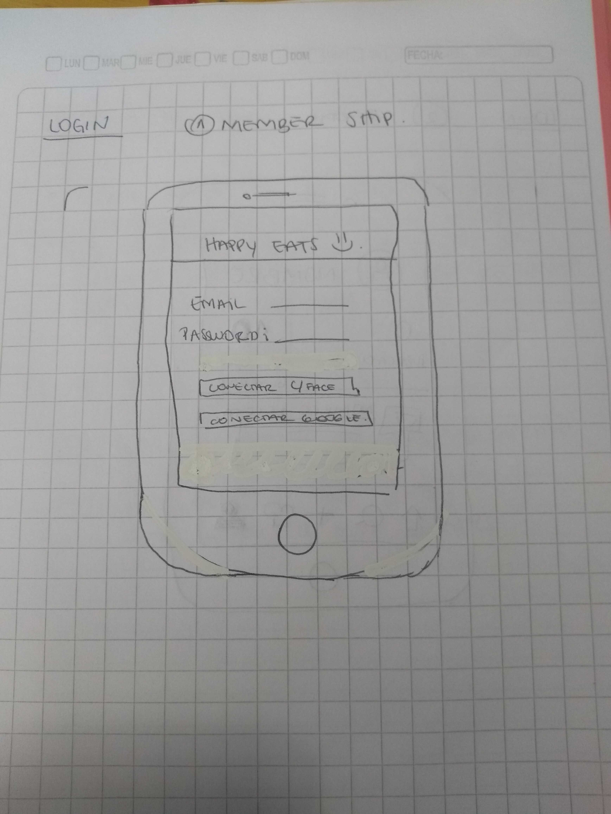
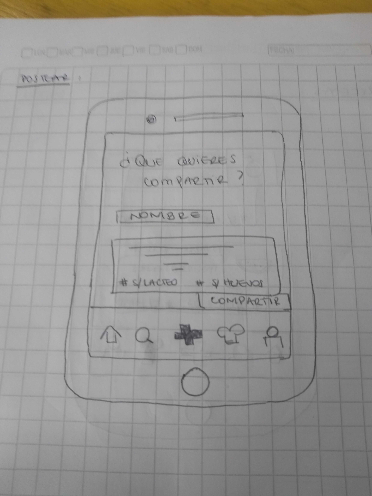
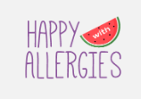

# Creando una Red Social

## Definición del producto 

**Happy With Allergies** es una red social que invita a todos las personas que sufren algún tipo de alergia alimentaria (o que tienen un familiar y/o amigo con este tipo de alergias) a compartir sus datos, recetas, información de locales o incluso solo conocer gente en su misma condición. 

## Investigación

En el mundo durante los últimos 50 años han disminuido drásticamente las enfermedades infecto-contagiosas, y han aumentado mucho las inflamatorias y autoinmunes, esto se debe a que con el paso del tiempo, las personas cada vez tienen menos contacto con bacterias, lo que hace que el sistema inmune tenga "menos trabajo" y se desvíe atacando al propio organismo. Es por esto que se estima que al menos el 10% de la población mundial posea algún tipo de alergia alimentaria y entre 6 a 8% en menores de 3 años. Datos recientes estiman que en chile el 5,5% de los escolares presentan alguna historia compatible (diagnosticada o sintomática) con estas alergias.

En base a nuestra investigación hemos descubierto que para las personas alérgicas o para los familiares/amigos de estos, no existe alguna red social que los identifique ( solo grupos cerrados de facebook) para compartir experiencias ó intercambiar datos informativos respecto al tema.  

Se realizó una encuesta a todas aquellas personas que tuvieran algún cercano con alergia o que padecieran de esta condición para conocer los siguientes datos: 

1. **Las alergias más frecuentes o conocidas fueron**: 

    * ALERGIA A LA PROTEÍNA DE LECHE DE VACA
    * ALERGIA AL GLUTEN

2. **La información más importante que necesitan estas personas** : 

    * LUGARES DONDE IR A COMPRAR ALIMENTOS
    * LUGARES DONDE SALIR A COMER
    * RECETAS

3. **Conocimiento de alguna aplicación que hable de estos temas** : 

    * NO
    * GRUPOS DE FACEBOOK

## Definición del usuario

El usuario de HappyWithAllergy son todas aquellas personas con alergia alimentaria a la Leche (ó Intolerancia) y al Trigo (Celiaquía) y/o su entorno que deseen pertenecer a una comunidad para compartir información o intercambiar experiencias en base a sus vivencias. 
 
## Historias de Usuario

### 1. Usuario Emprendedor

Juan, un emprendedor amante de la pastelería decide crear una línea saludable de galletas sin alérgenos (Trigo y Lácteos) por lo que quiere publicar su emprendimiento tanto para dar a conocer sus productos y aumentar sus ventas y para ayudar a todas las personas con algún problema de alergia alimentaria a tener acceso fácil y económico de dulces y pasteles que puedan consumir. 

* **Yo**: Usuario Emprendedor
* **Necesito**: Publicar mi emprendimiento
* **Para**:
    * Aumentar mis ventas
    * Ayudar a que las personas con alergia alimentaria tengan más y mejor acceso a productos sin alérgenos.

#### Criterios de aceptación 

1. **Cuando**: Un usuario que aún no se ha registrado quiere publicar

    **Entonces**: Se redirige a la automáticamente a la página de login.

2. **Dado**:Que el usuario ya está registrado

   **Cuando**: El usuario quiera publicar su emprendimiento

   **Entonces**: Se dirige al icono publicar para agregar su post. 

### 2. Usuario Objetivo (Alérgico)

Carolina tiene 25 años y nació con APLV por lo que a lo largo de su vida ha podido recopilar un serie de información, tips, recetas y datos útiles que le gustaría compartir con otras personas que viven su misma condición y no tienen tanto tiempo viviendo con esta alergia. 

* **Yo**:  Alérgica a la PLV 

* **Necesito**: Compartir recetas y/o datos.

* **Para**: Conocer y ayudar a otras personas con la misma condición

#### Criterios de aceptación 

1.  **Dado**: Que el usuario ya está registrado

    **Cuando**: El usuario quiera publicar.

    **Entonces**: Elige el tipo de publicación (receta, datos, información para comer).

2. **Dado**:Elige el tipo de publicación (receta, datos, información para comer).

   **Cuando**:El usuario escriba la publicación

   **Entonces**: Elige el hashtag de categorización.

### 3. Usuario Buscador

Gabriela, tiene un hijo de 6 años que hace dos semanas le diagnosticaron Celiaquía, esto a sido un cambio en su vida ya que ha tenido que cambiar todo el sistema de alimentación de toda la familia

* **Yo**:  Madre de un niño celíaco

* **Necesito**: Buscar alternativas que sustituyan el pan y otros alimentos.

* **Para**: Mejorar la calidad de vida de mi hijo.

#### Criterios de aceptación 

1.  **Dado**: Que el usuario quiere buscar 

    **Cuando**:  El usuaria elija que buscar ( por nombre o por hashtag)

    **Entonces**: Se muestran los resultados de su búsqueda. 

## Consideraciones de Diseño UI

### Sketch y Prototipado

Una vez definido el tema del proyecto se realizó una lluvia de ideas para la ideación a través de los sketch de las distintas vistas que tendrá el producto; a partir del cual se inicia el prototipo de baja fidelidad. 
Como el proyecto se trata de una red social pensamos en crear un menú con iconos al final de la pantalla, para facilitar el manejo de la aplicación al usuario.

### - Sketch 1. Pantalla Login

### - Sketch 2. Pantalla Inicio (Home)

### - Sketch 3. Pantalla Perfil Usuario

### - Sketch 4. Pantalla Crear Post

### - Sketch 5. Pantalla Recetas 

### - Sketch 6. Pantalla Buscar 

Una vez analizado los resultados de nuestra investigación y definido el usuario objetivo que queremos abarcar, concretamos el primer prototipo en base a las necesidades de nuestro público. 

### Consideraciones Diseño 

#### Logo

Considerando las conversaciones con usuarios llegamos a la conclusión de que el vivir con alergias alimentarias no tiene que tener una connotación negativa. Es así como logramos un nombre para nuestra aplicación web y su logo. 

#### Colores

La paleta de colores que se utilizó para realizar la aplicación tiene su explicación en que el morado en la nutrición es el color del equilibrio. Además los alimentos morados son ricos en antioxidantes que mantienen el sistema inmune protegido. Por lo tanto, las personas que padecen alergias alimentarias tienen que mantener un equilibrio en su alimentación. 

